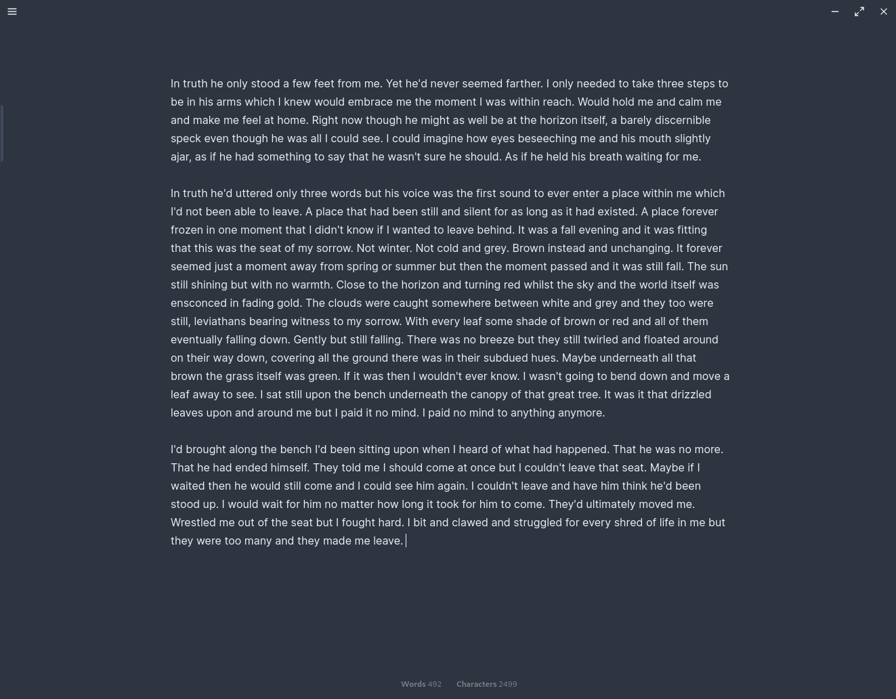

# Nord Writer

A [Nord color scheme](https://nordtheme.com) based theme for distraction free writing in [Standard Notes](https://standardnotes.org/). 

- The theme hides most UI elements. The status bar and file pane are shown on hover.
- If you have the Action Bar open, it will show the word and character counts and hide everything else.

Note: Based on [Standard Notes Writer](https://github.com/eenpadvinder/standardnotes-writer)

## Installation

Open "Extensions" in Standard Notes and click "Import Extension". Enter the following URL as Extension Link and press Enter:

```
https://listed.to/p/WAD0wCp1QS
```

## Preview



Word count:


